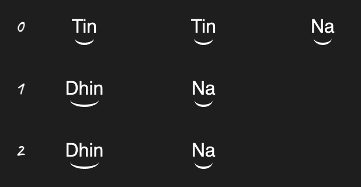

# Palta Obsidian Plugin

A plugin that allows you to write Kaydas, Gats and Relas in Obsidian. Under the hood it uses the `\<palta-note>` web component.


## Usage

Install the plugin. Then in any note you can create a palta code block with the follow structure: 

````
```palta
vibhags: 0 1 2
---
Tin Tin Na
Dhin Na
Dhin Na
```
````

which will then be rendered into:



