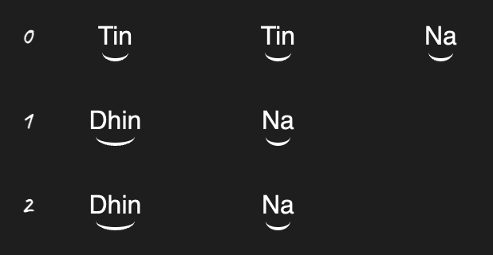
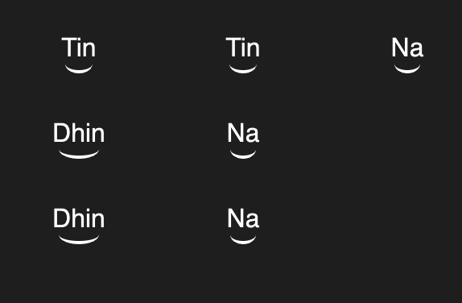

# Palta Note Obsidian Plugin

Write Kaydas, Gats and Relas in Bhatkhande notation in Obsidian. Under the hood it uses the [`<palta-note>`](https://github.com/mrniket/palta-note) web component.


## Usage

Install the plugin. Then in any note you can create a palta code block with the follow structure: 

````
```palta
vibhags: 0 1 2
---
Tin Tin Na
Dhin Na
Dhin Na
```
````

which will then be rendered into:



### Without vibhags

You can also choose to not specify the vibhag structure (if you want to quickly note things down for example):

````
```palta
Tin Tin Na
Dhin Na
Dhin Na
```
````

